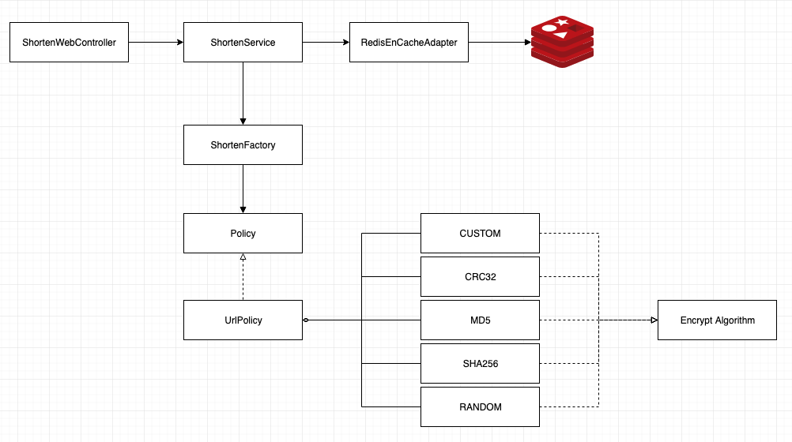
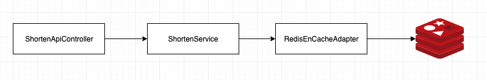

# [사전과제 프로젝트 내용]

URL 을 입력받아 짧게 줄여주고, Shortening 된 URL 을 입력하면 원래 URL 로 리다이렉트 하는 URL Shortening Service

예) https://en.wikipedia.org/wiki/URL_shortening => http://localhost/JZf0QNro

## 요구사항

* webapp 으로 개발하고 URL 입력 폼 제공 및 결과 출력
* URL Shortening Key 는 8 Character 이내로 생성되어야 합니다.
* 동일한 URL 에 대한 요청은 동일한 Shortening Key 로 응답해야 합니다.
* Shortening 된 URL 을 요청 받으면 원래 URL 로 리다이렉트 되어야 합니다.
* Shortening Key 생성 알고리즘은 직접 구현해야 합니다. (라이브러리 생성 불가)
* Unit Test 코드 작성
* Database 사용은 필수 아님 (선택)

## 기타

* README.md 파일에 프로젝트 소개 및 문제해결 전략 그리고 프로젝트 빌드와 실행방법 명시
* 언어, 프레임워크 제한 없음

___ 

## Workflow

### 생성



1. 단축 URL 생성 페이지 접속
2. 화면 입력 폼에 URL 입력
    * 화면상에서 입력된 URL 이 유효한지 검증 
3. 입력이 완료된 URL 을 변환 요청
4. 프론트에서 요청한 입력값 검증
5. URL 인크립트
    1. 인크립트 생성 정책에 의해 URL 인크립트 
        * CUSTOM -> CRC32 -> MD5 -> SHA256 -> 임의의 문자열
    2. 인크립트 한 결과가 기존에 Redis 에 저장되어 있는지 확인
        1. 만약 동일한 결과가 저장되어 있으면 동일한 경로로 인크립트했는지 확인
        2. 인크립트 결과 및 경로 URL 이 동일하다면 다음 알고리즘 정책으로 인크립트
        3. 인크립트 결과가 다를때까지 위 (a), (b) 과정을 반복  
6. Redis 에 결과값 저장
7. 프론트로 변환값 전달

### 사용



1. 단축 URL 을 요청
    * GET 방식으로만 허용
2. 원본 URL 반환
    1. 기존에 EnCache 에 저장되어 있는 값이 있으면 해당 값을 반환
        * EnCache 은 저장된 기본 정책에 의거 
        * [encache.xml](./src/main/resources/config/ehcache.xml) 에서 urlCache 아이디 값으로 설정
    2. 데이터 추출
        * 인크립트된 값을 키로 Redis 에서 추출
5. 원본 경로로 리다이렉션
    5.1 308 Permanent Redirect

> 그 외의 예외는 모두 404 페이지 혹은 500 페이지로 이동  
> 이동 후에는 약 8초간 대기후 메인 페이지로 이동

---

## Getting Started

### Version Specification

* JDK 1.8+
* Spring Framework Boot 2.1.8
* JUnit 5.5.2
* Lombok
* Redis (Docker)
* Thymeleaf
* Bootstrap 4.3.1
* JQuery 2.2.4

### Installation

* Spring port : 8080
* Redis port : 6379

```bash
$ gradle build

$ gradle bootRun
```

혹은

```bash
$ java -jar shorten-0.0.1-SNAPSHOT.jar
```

## 최초 설치

### Docker 

```bash
$ docker pull redis:latest
```

```bash
$ docker run -p 6379:6379 --name redis_boot -d redis
```

### Spring Boot Project Files

```bash
$ gradle build
```

## 프로젝트 기동

### Redis 기동

```bash
$ docker start redis_boot 
```

### Redis 접속

```bash
$ docker exec -it redis_boot redis-cli
```

### 실행

```bash
$ gradle build
```

```bash
$ java -jar ./build/libs/shorten-0.0.1-SNAPSHOT.jar 
```

or

```bash
$ gradle bootRun
```

or

```bash
$ ./gradlew bootRun
```

[http://localhost:8080/](http://localhost:8080/) 으로 접속하여 사용

---

## Feature

* 프론트 키 입력에 따른 URL Validation 체크 
* RBAC 관점에서 인크립트 정책 및 알고리즘의 권한의 역활 고려
    * URL 정책에 따른 알고리즘 분리
    * 인크립트 정책 실행 Actor (EncryptFactory.class) 를 별도로 분리
* Redis 를 이용한 외부 DB 자원 활용으로 강제적 인터벌 주입 

## TODO

* CUSTOM Encrypt 알고리즘 개선
    * CRC32 스팩에 가깝게 속도 및 중복 개선
* Custom Exception 정의
    * 환경별 로그 수집 정책에 따른 로그 개선
* 프론트 환경 개선
    * jQuery -> VanillaJS
    * UI 레이아웃 Flexible 로 개선 (모바일 및 반응형 접근성 개선)
    * UI 인터렉션 개선하여 가독성과 사용성을 높일수 있게 고려
* 히스토리 저장 가능하게 끔 방향 모색
* 사용자 권한관리 혹은 라이선스 추가 고려
    * 권한에 따른 리소스 관리 (데이터 생성 / 수정 / 삭제 / 라이프타임)
* 사용자가 원하는 인크립트 방식 제공 (CRC32 우선 혹은 무조건적인 랜덤값)
* 기본 정책 수정가능한 도구 제공
